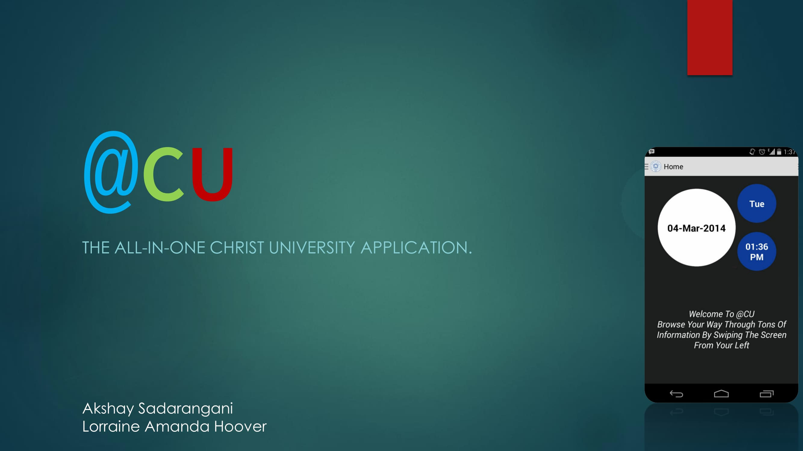
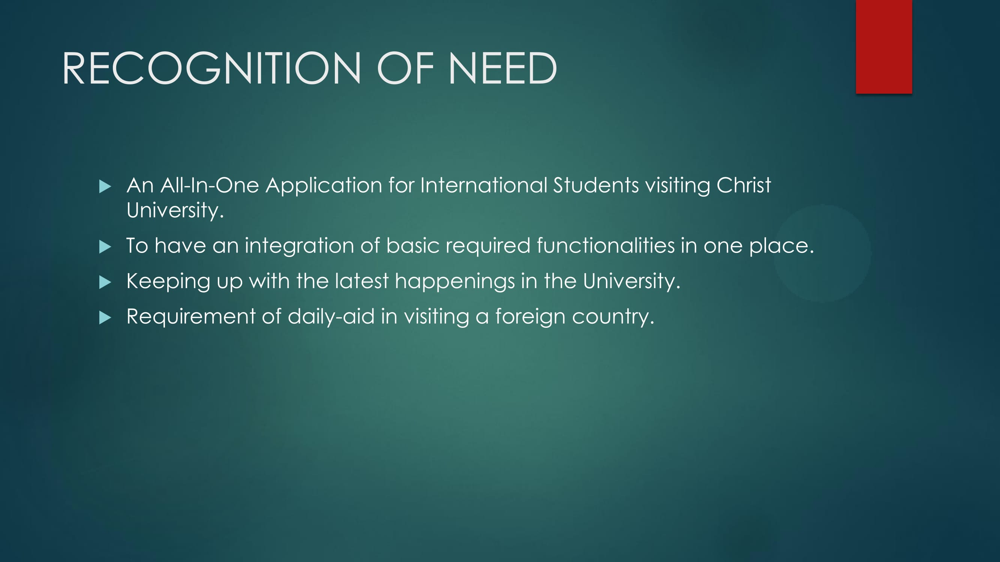
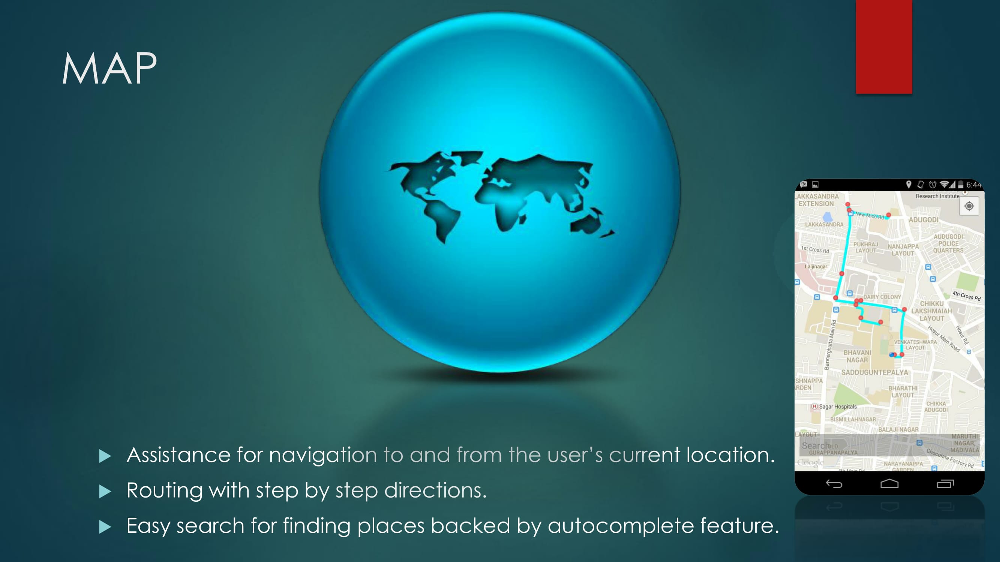
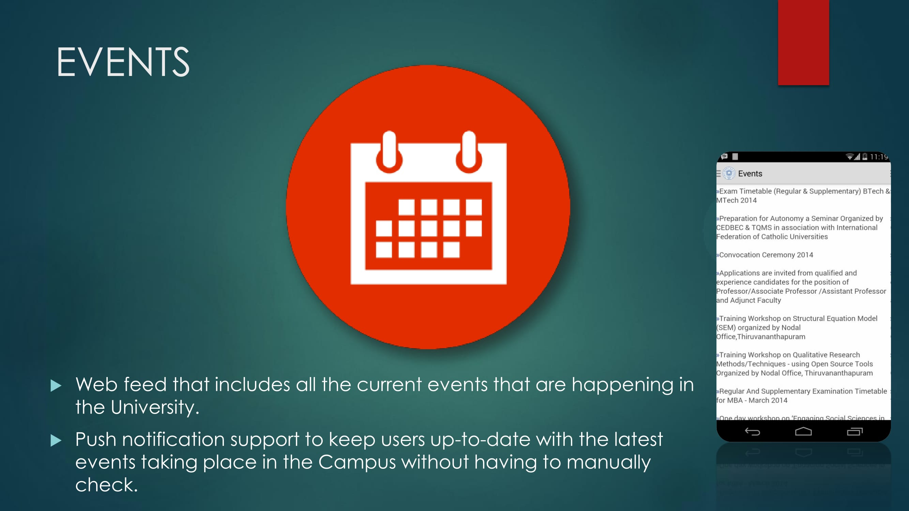
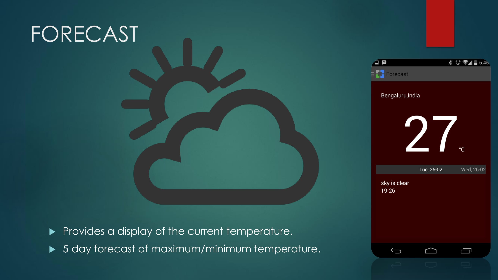
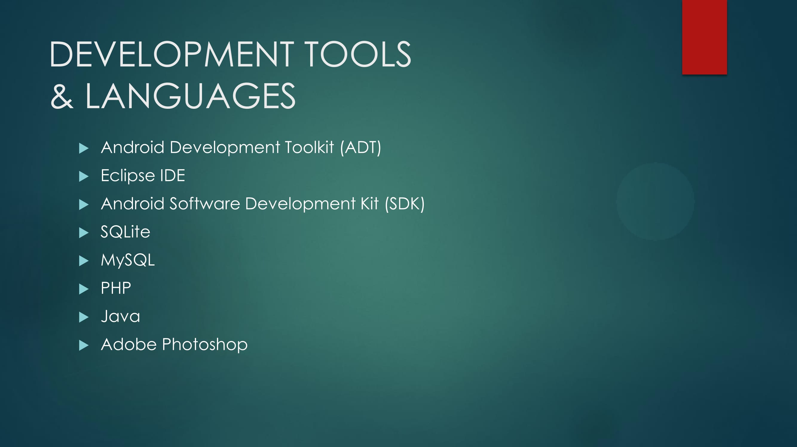

# @CU
## Introduction
Foreign students coming to Christ University, India face problems in getting access to information and services. Language barrier adds to the lack of proper guidance. Currently the best source of information available to them is via the Internet viz. Google and Google Maps which has various assorted data with its limitations of information not pertaining to the students.
The proposed system aims to solve the various difficulties faced by the international students by incorporating all necessary and relevant information on a mobile application which is built on the Android platform. The application is meant to aid students in travelling and exploring in-campus areas as well as areas around the campus. The features of the proposed system include news and updates pertaining to the university, events which are directly synchronized with the built-in calendar and aided by push notifications, multimedia gallery for photos and videos of the university. Apart from the in-campus features, the application will also have features such as transportation finder to help find the easiest and best possible route to and from the campus, shopping areas, hotels and eateries near the campus, places of interest in the city and emergency contact services. 
## Modules
> * Notes
> * Gallery
> * Map
> * Scheduler
> * Events with push notifications
> * Contacts
> * Currency coverter
> * Translator
> * Forecast

## Screenshots

##Bugs and Feedback
For bugs, questions and discussions please use the [Github Issues](https://github.com/aksh4y/CU/issues).
